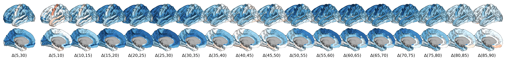

---

# Human cortex development is shaped by molecular and cellular brain systems

This repository accompanies the preprint: 

Leon D. Lotter, Amin Saberi, Justine Y. Hansen, Bratislav Misic, Gareth J. Barker, Arun L.W. Bokde, Sylvane Desrivières, Herta Flor, Antoine Grigis, Hugh Garavan, Penny Gowland, Andreas Heinz, Rüdiger Brühl, Jean-Luc Martinot, Marie-Laure Paillère, Eric Artiges, Dimitri Papadopoulos Orfanos, Tomáš Paus, Luise Poustka, Sarah Hohmann, Juliane H. Fröhner, Michael N. Smolka, Nilakshi Vaidya, Henrik Walter, Robert Whelan, Gunter Schumann, IMAGEN Consortium, Frauke Nees, Tobias Banaschewski, Simon B. Eickhoff, and Juergen Dukart (2023). *[Human cortex development is shaped by molecular and cellular brain systems](https://doi.org/XXX)*. bioRxiv.

  
[Zenodo]  

## Abstract

Human brain morphology undergoes complex developmental changes with diverse regional trajectories. Various biological factors influence cortical thickness development, but human data are scarce. Building on methodological advances in neuroimaging of large cohorts, we show that population-based developmental trajectories of cortical thickness unfold along patterns of molecular and cellular brain organization. During childhood and adolescence, distributions of dopaminergic receptors, inhibitory neurons, glial cell populations as well as features of brain metabolism explain up to 50% of variance associated with regional cortical thickness trajectories. Cortical maturation patterns in later life are best explained by distributions of cholinergic and glutamatergic systems. These observations are validated in longitudinal data from over 8,000 adolescents, explaining up to 59% of developmental change at population- and 18% at single-subject level. Integrating multilevel brain atlases with normative modeling and population neuroimaging provides a biologically and clinically meaningful path to understand typical and atypical brain development in living humans.

 
  
 

## License

  

All data and code in this repository are licensed under a [Creative Commons Attribution-NonCommercial-ShareAlike 4.0 International License](http://creativecommons.org/licenses/by-nc-sa/4.0/).

Please cite both the publication and the dataset (Zenodo) when using data from this repository.

## Content

### `Jupyter notebooks`
The Jupyter notebooks contain all the analyses code in sequential order. The analyses are finalized but I will update the notebooks with more detailed descriptions and in-line comments of each analysis step.

### `data_predictors`
Contains the data used as "predictors" in spatial association analyses. I.e, you can find the original PET imaging and extracted data, lists of cell marker genes and extracted ABA gene expression data, and an T1/T2 ratio MRI surface file as a myelination marker. In table files, you find the extracted and dimensionality reduced data that was used for the majority of the analyses.  

### `model_rutherford`
Contains the [Braincharts model](https://github.com/predictive-clinical-neuroscience/braincharts) by Rutherford et al. (2022) 

### `data_rutherford`
Contains the data that were extracted from the Braincharts model to be used for the analyses. The output data of the spatial association analyses performed in "1_predictions_rutherford.ipynb", wrapped into JuSpyce objects, are relatively large (~300 MB per file). Admittedly, this is in part due to inefficient storage and will be fixed in the future. As the data can't be included in a GitHub repo, they are available in a separate [OSF repository](https://osf.io/ytvkh/). There is a line of code in the respective notebook that automatically downloads the data from OSF if you uncomment it.  

### `data_ABCD-IMGN`
This is empty and would contain the ABCD and IMAGEN in- and output data. These data are protected and thus not included in the repository. If you would like to access the data AND already have ABCD or IMAGEN access approval, feel free to contact us. The code, however, is included in this repository. See also the notes in each notebook.  

### `plots`
All plots generated in the notebooks.

### `scripts`
All analyses scripts. Because the [JuSpyce toolbox](https://github.com/LeonDLotter/JuSpyce) on which we heavily rely here is not on pip yet, I included the used version of JuSpyce in the repository (`/scripts/juspyce`). 

### `templates`
Contains only the Destrieux parcellation as left and right hemisphere gifti files.

## Further resources

- [Braincharts model](https://github.com/predictive-clinical-neuroscience/braincharts) by Rutherford et al. (2022)  
- [Neuromaps toolbox](https://github.com/netneurolab/neuromaps)
- [JuSpyce](https://github.com/LeonDLotter/JuSpyce)
- [JuSpace](https://github.com/juryxy/JuSpace) 

## Contact

If you have any problems, questions, comments or suggestions, feel free to open an issue or [contact me](mailto:leondlotter@gmail.com)! 

---
  

[Back to the top](#top)
